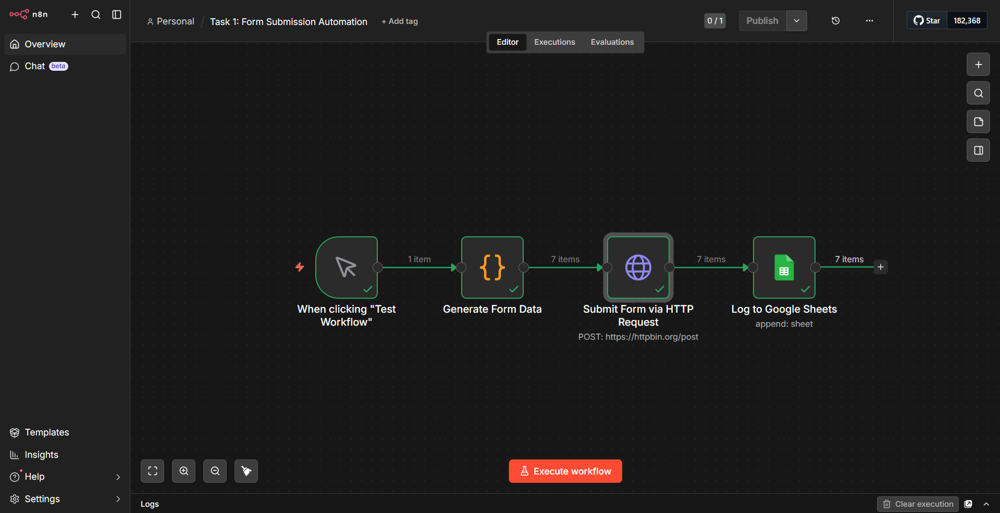
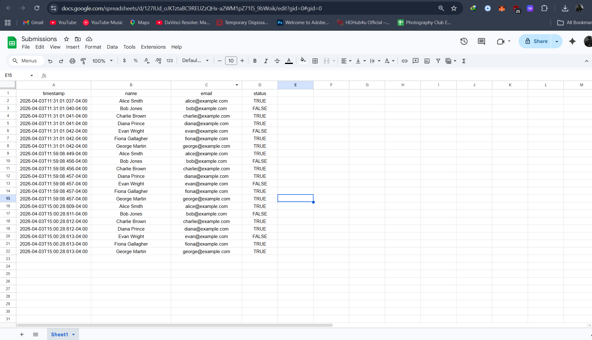
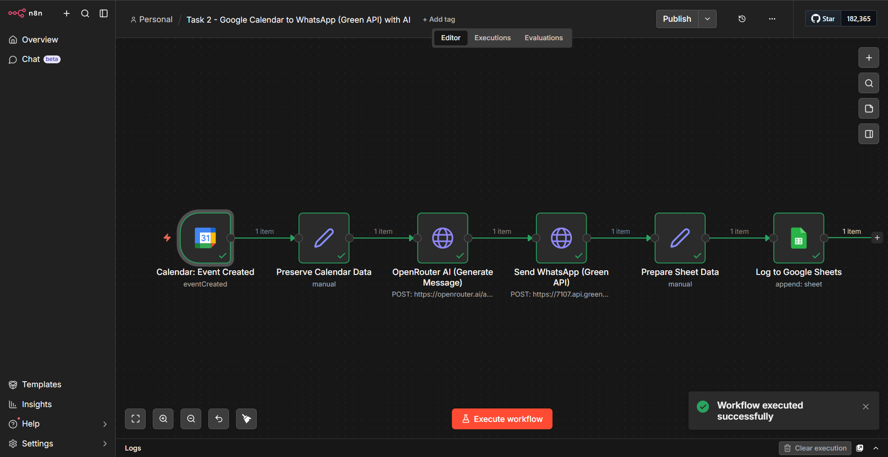
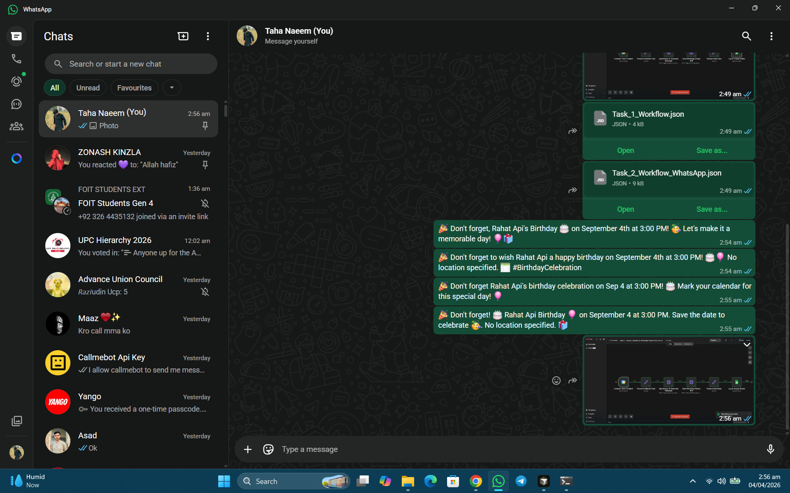
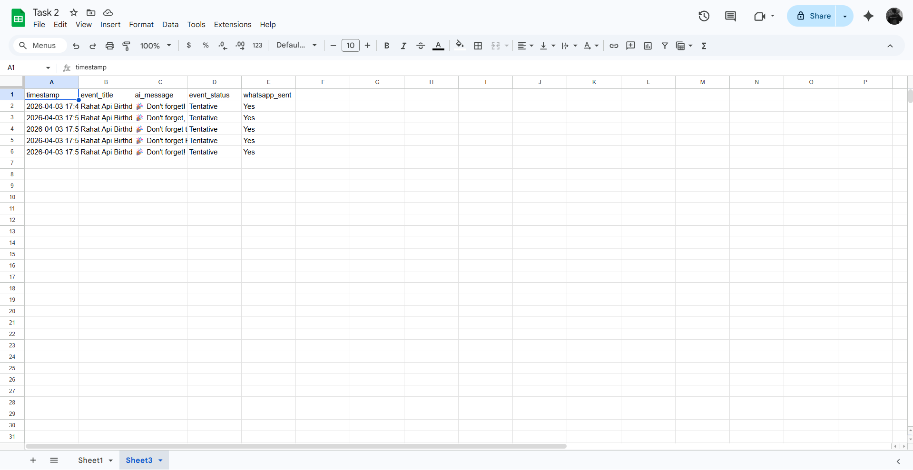
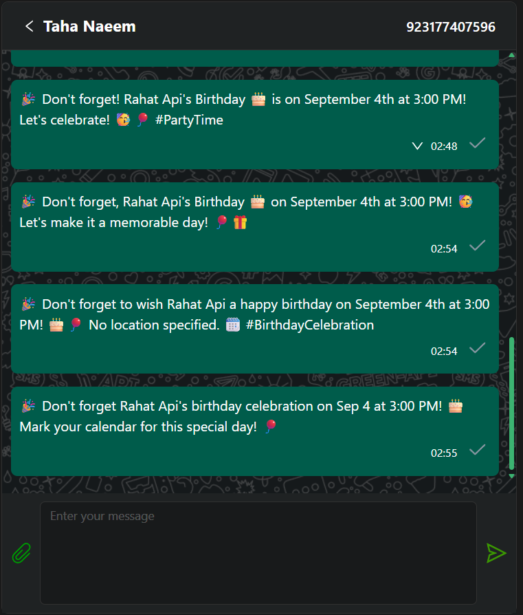

<div align="center">
  
  <h1>n8n AI-Powered Workflow Automation</h1>
  <p><strong>Tools & Techniques for Data Science — Assignment 2</strong></p>
  <p>
    
    
    
    
    
    
  </p>
</div>

---

## Overview

This repository showcases two practical workflow automation pipelines built with **n8n**, an open-source fair-code automation tool. The project demonstrates how to connect diverse APIs and services through visual programming, eliminating manual overhead in data science and business operations.

| Workflow | Source | Destination | Enhancement |
|----------|--------|-------------|-------------|
| **Task 1** | Manual / Webhook Trigger | Google Sheets | HTTP POST simulation via `httpbin.org` |
| **Task 2** | Google Calendar | Telegram / WhatsApp | AI-generated messages via OpenRouter |

---

## Table of Contents

- [Workflows](#workflows)
  - [Task 1: Form Submission Automation](#task-1-form-submission-automation)
  - [Task 2: AI-Powered Event Notifications](#task-2-ai-powered-event-notifications)
- [Getting Started](#getting-started)
  - [Prerequisites](#prerequisites)
  - [Setup Instructions](#setup-instructions)
  - [Environment Variables](#environment-variables)
- [Security](#security)
- [Screenshots](#screenshots)
- [Architecture](#architecture)
- [Technologies Used](#technologies-used)
- [License](#license)

---

## Workflows

### Task 1: Form Submission Automation

A data pipeline that generates structured form submissions (name, email, age, preferences) and logs them to Google Sheets.

**Flow:** `Manual Trigger → Generate Data (JS Code) → HTTP POST (httpbin.org) → Google Sheets`

```
┌──────────────┐     ┌──────────────┐     ┌──────────────────┐     ┌──────────────┐
│  Manual      │────→│  Generate    │────→│  HTTP Request    │────→│  Google      │
│  Trigger     │     │  Form Data   │     │  (POST /echo)    │     │  Sheets      │
└──────────────┘     └──────────────┘     └──────────────────┘     └──────────────┘
```

**Key Features:**
- Simulates a real REST API interaction without external dependencies
- Prepares structured JSON with text, numeric, dropdown, and boolean fields
- Logs submission timestamp, user name, email, and subscription status to Google Sheets
- Production-ready with a simple swap from Manual to Webhook trigger

### Task 2: AI-Powered Event Notifications

An event-driven notification system that monitors Google Calendar and delivers smart, personalized alerts via Telegram or WhatsApp — with an AI layer that transforms raw event data into engaging messages.

**Flow (Telegram):** `Google Calendar Trigger → Data Mapping → OpenRouter AI → Telegram Bot → Google Sheets Log`

**Flow (WhatsApp):** `Google Calendar Trigger → Data Mapping → OpenRouter AI → Green API (WhatsApp) → Google Sheets Log`

```
┌──────────────┐     ┌──────────────┐     ┌──────────────┐     ┌──────────────┐     ┌──────────────┐
│  Google      │────→│  Preserve    │────→│  OpenRouter  │────→│  Telegram /  │────→│  Google      │
│  Calendar    │     │  Data        │     │  AI          │     │  WhatsApp    │     │  Sheets      │
└──────────────┘     └──────────────┘     └──────────────┘     └──────────────┘     └──────────────┘
```

**Key Features:**
- Monitors calendar events for Create, Update, Cancel, and Start actions
- Uses OpenRouter AI (GPT-3.5 Turbo) to generate fun, context-aware messages
- Sends via Telegram Bot **or** WhatsApp (Green API) — both implementations included
- Logs each notification with event details, AI-generated message, and delivery status
- Fully configurable: swap AI model, messaging platform, or calendar with minimal changes

---

## Getting Started

### Prerequisites

- [Docker Desktop](https://www.docker.com/products/docker-desktop/) installed and running
- [n8n](https://n8n.io/) — local or cloud instance
- API keys (see [Setup Instructions](#setup-instructions))

### Setup Instructions

#### 1. Start n8n Locally

```bash
docker run -it --rm \
  --name n8n \
  -p 5678:5678 \
  -v n8n_data:/home/node/.n8n \
  docker.n8n.io/n8nio/n8n
```

Navigate to [http://localhost:5678](http://localhost:5678).

#### 2. Import Workflows

1. In n8n, go to **Workflows → Add Workflow**
2. Click the ellipsis (⋮) in the top-right → **Import from File**
3. Select the desired workflow from the `workflows/` directory:
   - `workflows/Task_1_Workflow.json`
   - `workflows/Task_2_Telegram_AI_Workflow.json`
   - `workflows/Task_2_WhatsApp_AI_Workflow.json`

#### 3. Configure Environment Variables

Copy `.env.example` to `.env` and fill in your credentials:

```bash
cp .env.example .env
```

All workflows reference environment variables via `{{$env.VAR_NAME}}` — no secrets are hardcoded in the JSON files. See [Environment Variables](#environment-variables) for the full list.

#### 4. Load Environment Variables in n8n

Start n8n with the `--env` flag pointing to your `.env` file:

```bash
docker run -it --rm \
  --name n8n \
  -p 5678:5678 \
  -v n8n_data:/home/node/.n8n \
  -v $(pwd)/.env:/home/node/.env \
  -e N8N_ENV_FILE=/home/node/.env \
  docker.n8n.io/n8nio/n8n
```

Alternatively, set variables directly via Docker `-e` flags:

---

### Environment Variables

| Variable | Required | Description |
|----------|----------|-------------|
| `OPENROUTER_API_KEY` | Yes | OpenRouter AI API key ([get one here](https://openrouter.ai/keys)) |
| `GOOGLE_SHEET_ID` | Yes | Google Sheet document ID (from the sheet URL) |
| `TELEGRAM_BOT_TOKEN` | For Telegram | Telegram bot token from [@BotFather](https://t.me/BotFather) |
| `TELEGRAM_CHAT_ID` | For Telegram | Your Telegram user ID (ask [@userinfobot](https://t.me/userinfobot)) |
| `GREEN_API_INSTANCE` | For WhatsApp | Green API instance ID |
| `GREEN_API_TOKEN` | For WhatsApp | Green API access token |
| `WHATSAPP_CHAT_ID` | For WhatsApp | Target WhatsApp number (e.g., `923001234567@c.us`) |

> **Note:** Google Calendar / Sheets nodes also require OAuth2 credentials configured directly in n8n's credential store. The environment variables above handle API keys and tokens only.

### Security

- **No secrets in code.** All API keys, tokens, and IDs are injected via environment variables (`$env.*`), never hardcoded in workflow files.
- **`.env` is gitignored.** The `.env.example` template is safe to commit; your real `.env` stays local.
- **OAuth2 for Google APIs.** Google Sheets and Calendar use n8n's built-in OAuth2 credential store, keeping tokens encrypted.
- **Report vulnerabilities.** If you find a security issue, please open a [GitHub Issue](https://github.com/mtahanaeem/n8n-ai-workflow-automation/issues).

---

#### 5. Test the Workflows

- **Task 1:** Click **Execute Workflow** — inspect the HTTP Response output
- **Task 2:** Create a test event on your Google Calendar — the AI will generate a message and deliver it within a minute

---

## Screenshots

| Workflow Canvas | Execution Output | Telegram Delivery |
|:---:|:---:|:---:|
|  |  | .png) |
|  |  | .png) |
|  |  | .png) |

---

## Architecture

```
                    ┌──────────────────┐
                    │   Google         │
                    │   Calendar       │
                    └────────┬─────────┘
                             │ Event (Create/Update/Cancel/Start)
                             ▼
                    ┌──────────────────┐
                    │   n8n Engine     │
                    │  (Workflow)      │
                    └──┬───────┬───────┘
                       │       │
                       ▼       ▼
              ┌──────────┐  ┌──────────┐
              │ OpenRouter│  │ Telegram │
              │ AI (GPT)  │  │ /WhatsApp│
              └─────┬─────┘  └─────┬────┘
                    │              │
                    └──────┬───────┘
                           ▼
                    ┌──────────────────┐
                    │  Google Sheets   │
                    │  (Logging)       │
                    └──────────────────┘
```

- **Trigger Layer:** Google Calendar webhook triggers, polled every minute
- **Processing Layer:** Data transformation (n8n expressions) → AI enrichment (OpenRouter GPT-3.5) → message formatting
- **Delivery Layer:** Telegram Bot API / WhatsApp Green API
- **Persistence Layer:** Google Sheets append for audit trail

---

## Technologies Used

| Technology | Purpose |
|------------|---------|
| [n8n](https://n8n.io/) | Workflow automation engine (visual node-based programming) |
| [Docker](https://www.docker.com/) | Containerized n8n deployment |
| [OpenRouter AI](https://openrouter.ai/) | Unified API for GPT-3.5 Turbo & other LLMs |
| [Telegram Bot API](https://core.telegram.org/bots/api) | Send instant notifications |
| [Green API](https://green-api.com/) | WhatsApp Business messaging |
| [Google Sheets API](https://developers.google.com/sheets/api) | Data persistence & logging |
| [Google Calendar API](https://developers.google.com/calendar/api) | Event source trigger |
| [httpbin.org](https://httpbin.org/) | Request/response debugging endpoint |

---

## License

This project is submitted as part of an academic assignment. Licensed under the MIT License.

---

<div align="center">
  <sub>Built with ❤️ for Tools & Techniques for Data Science</sub>
</div>
